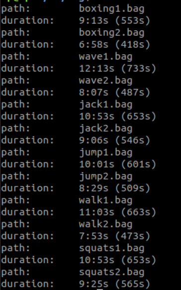
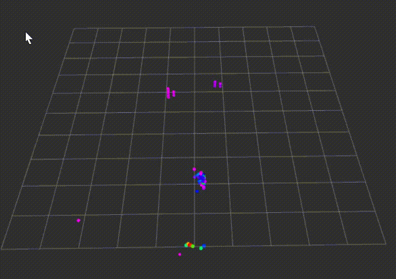
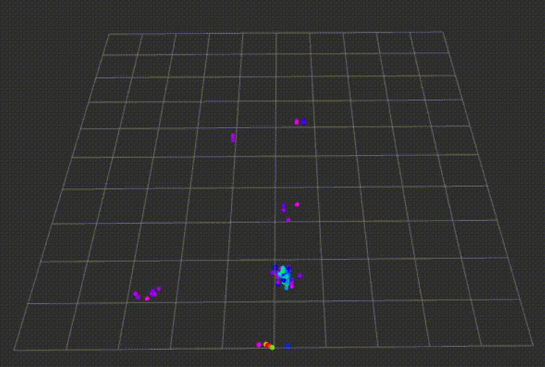
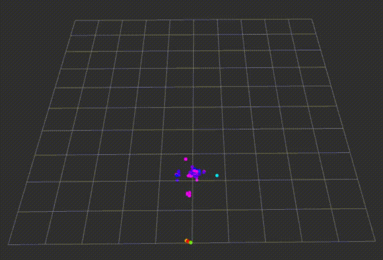
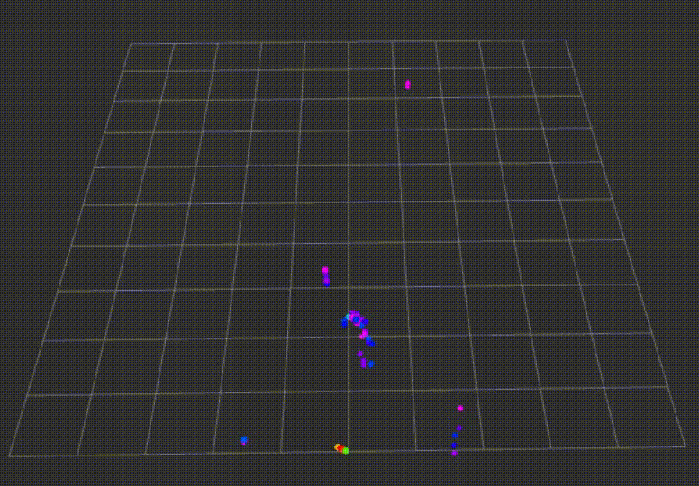
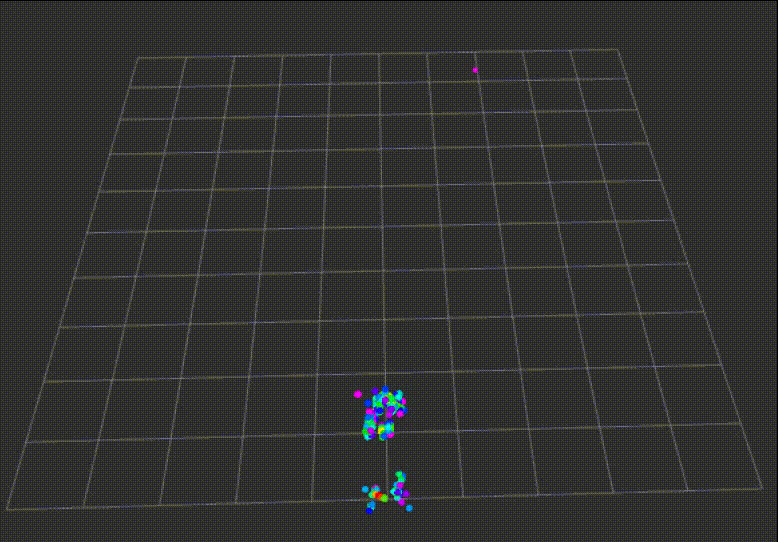
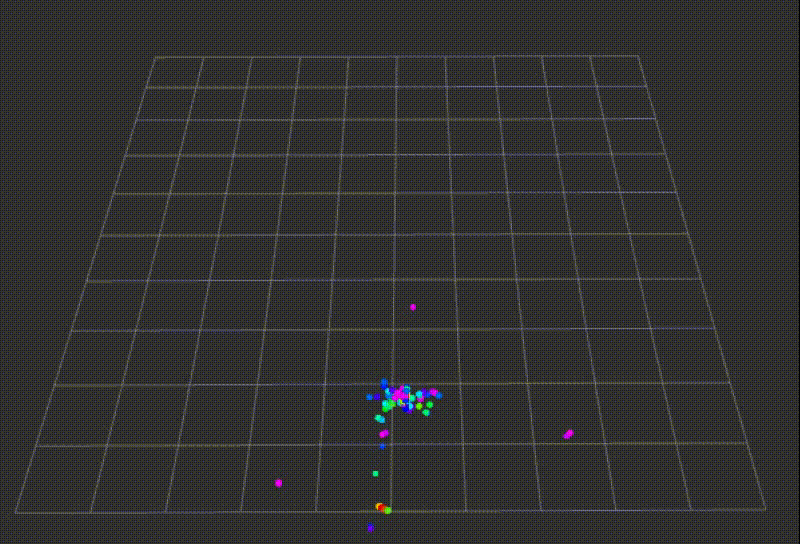

# 目录

* [说明](#说明)
* [数据信息](#数据信息)
* [使用方法](#使用方法)
* [动作类型](#动作类型)
	* [jump](#jump)
	* [squats](#squats)
	* [wave](#wave)
	* [walk](#walk)
	* [boxing](#boxing)
	* [jack](#jack)
* [iwr6843isk搭建ROS环境](#iwr6843isk搭建ros环境)
	* [需求](#需求)
	* [安装ROS](#安装ROS)
	* [使用ti_mmwave_rospkg ROS驱动程序](#使用-ti_mmwave_rospkg-ros-驱动程序)
	* [硬件设置](#硬件设置)
	* [其它](#其它)
* [to_txt中数据预处理(滑窗处理)](#to_txt中数据预处理(滑窗处理))

## 说明

本文件包含使用iwr6843isk雷达采集6类人体动作的bag文件，并且含有用于bag文件提取`/ti_mmwave/radar_scan`主题的消息为txt的文件

将消息分为训练集和测试集(最终生成文件夹为`to_txt`)

使用方式

1. 将bag文件放在`bag`文件夹中

2. 创建文件夹`to_txt`

3. 修改class_names中的种类类型, 训练集的比例

4. `python ./rosbag_process.py` 

5. 处理后的文件放在to_txt中，其中文件树为

	```txt
	├── README.md
	├── bag
	│   ├── boxing1.bag
	│   ├── boxing2.bag
	│   ├── jack1.bag
	│   ├── jack2.bag
	│   ├── jump1.bag
	│   ├── jump2.bag
	│   ├── squats1.bag
	│   ├── squats2.bag
	│   ├── walk1.bag
	│   ├── walk2.bag
	│   ├── wave1.bag
	│   └── wave2.bag
	├── info.sh
	├── info.png
	├── rosbag_process.py
	└── to_txt
		├── test
		│   ├── boxing.txt
		│   ├── jack.txt
		│   ├── jump.txt
		│   ├── squats.txt
		│   ├── walk.txt
		│   └── wave.txt
		└── train
			├── boxing.txt
			├── jack.txt
			├── jump.txt
			├── squats.txt
			├── walk.txt
			└── wave.txt
	```

	
	
**这里分开后的txt文件还需要经过滑动窗口处理!**

详细见[TwoStage_sliding_processing](https://github.com/JUSTWILLPOWER/TwoStage_sliding_processing)文件(这里是为了也能够处理`radhar`数据集所以这样设计)

## 数据信息

我们总共采集了114分钟的数据, 相对于`radhar数据集`我们新增了`挥手动作`

- **拳击(17分钟)**
- **挥手(20分钟)**
- **开合跳(20分钟)**
- **上下跳(18分钟)**
- **行走(19分钟)**
- **下蹲(20分钟)**


 


## 使用方法


1. 首先你需要搭建[ROS环境](1#iwr6843isk搭建ros环境)
2. 安装必要的包

	`pip install --extra-index-url https://rospypi.github.io/simple/ rosbag`

	`pip insatall sklearn`

3. 开始处理

	`python3 ./rosbag_process.py`

	
## 动作类型

### jump

 

### squats

 

### wave
 

### walk

 

### boxing

 

### jack

 


## iwr6843isk搭建ROS环境


### 需求
`ubuntu-18.04版本`

### 安装ros
[安装教程](http://wiki.ros.org/melodic/Installation/Ubuntu)

首先安装必要软件
`sudo apt install git curl vim -y `

设置您的计算机以接受来自 packages.ros.org 的软件
`sudo sh -c 'echo "deb http://packages.ros.org/ros/ubuntu $(lsb_release -sc) main" > /etc/apt/sources.list.d/ros-latest.list'`

设置您的密钥

`curl -s https://raw.githubusercontent.com/ros/rosdistro/master/ros.asc | sudo apt-key add -`

首先，确保您的 Debian 软件包索引是最新的：

`sudo apt update`

直接桌面完整安装
`sudo apt install ros-melodic-desktop-full`

环境设置
`echo "source /opt/ros/melodic/setup.bash" >> ~/.bashrc`
刷新环境
`source ~/.bashrc`

### 使用 ti_mmwave_rospkg ROS 驱动程序

此部分参考ti官网的ros教程
位置为<kbd>mmwave_industrial_toolbox_4_10_1/labs/Robotics/ros_driver/docs/TI_mmWave_ROS_Driver_Users_Guide.html</kbd>
[下载地址](https://dev.ti.com/tirex/explore/node?node=AN-1gXp4Kn1RRFC9mOFTZQ__VLyFKFf__LATEST&search=ros)


您的用户帐户必须是“dialout”unix 组的成员才能访问 Linux 上的串行端口。要检查您是否是该组的成员，请运行“组”命令。如果您已经是“拨出”组的成员，则输出应列出“拨出”（除了其他组）。如果您不是“dialout”组的成员，请运行以下命令将您的用户帐户添加到该组，然后注销并登录到 Linux 以使更改生效：

`sudo adduser <your_username> dialout`

执行此命令后，==请注销并重新登录到 Linux==，以便更改生效。

从 git.ti.com 克隆 git 存储库。
`git clone https://git.ti.com/git/mmwave_radar/mmwave_ti_ros.git`

将目录更改为 ROS 驱动程序实验室。这是工作区目录。
` cd mmwave_ti_ros/ros_driver/`
建立
`catkin_make`


刷新新环境
`source devel/setup.bash`
**注意:可以将其加入到.bashrc中，就不用每次都source了**
`echo "source ~/mmwave_ti_ros/ros_driver/devel/setup.bash" >> ~/.bashrc`


### 硬件设置
如果使用评估版单个EVM，那么首先要做的就是刷固件


将其拨到刷写模式，使用`uniflash`工具进行刷写


其中固件为
<kbd>\ti\mmwave_industrial_toolbox_4_10_1\labs\Out_Of_Box_Demo\prebuilt_binaries\xwr6843ISK_mmw_demo.bin</kbd>


选择串行口，而不是数据口


刷写完成后，将拨码开关拨到功能模式
插入
修改对应的文件


`6843_multi_3d_0.launch`

修改数据端口


###  其它
[python3运行ros方法 No module named 'rospkg'](https://blog.csdn.net/weixin_43046653/article/details/102930894)

`pip3 install rospkg netifaces defusedxml`


## to_txt中数据预处理(滑窗处理)

[二阶段滑动窗口处理点云发布的数据](https://github.com/JUSTWILLPOWER/TwoStage_sliding_processing)
